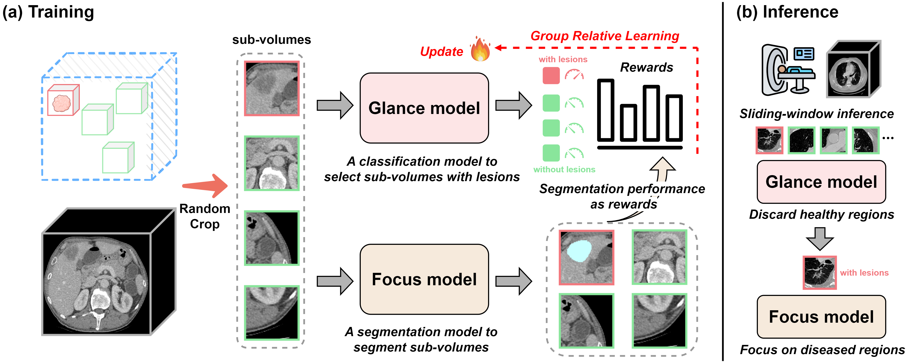
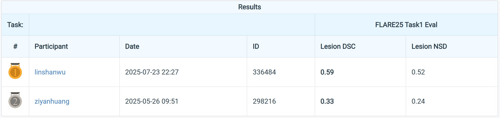

<div align="center">
<h1>[ICLR 2026] Glance and Focus Reinforcement for Pan-cancer Screening</h1>

<a href="http://arxiv.org/abs/2601.19103"></a>
<a href='https://huggingface.co/datasets/linshangmail/Pancancer'></a>
</div>

Linshan Wu, Jiaxin Zhuang, [Hao Chen](https://scholar.google.com/citations?user=Z_t5DjwAAAAJ&hl=en). [**Glance and Focus Reinforcement for Pan-cancer Screening**](http://arxiv.org/abs/2601.19103). ICLR 2026

### Introduction
Pan-cancer screening in large-scale CT scans remains challenging for existing AI methods, primarily due to the difficulty of localizing diverse types of tiny lesions in large CT volumes. The extreme foreground-background imbalance significantly hinders models from focusing on diseased regions, while redundant focus on healthy regions not only decreases the efficiency but also increases false positives. Inspired by radiologists' glance and focus diagnostic strategy, we introduce **GF-Screen**, a Glance and Focus reinforcement learning framework for pan-cancer screening. GF-Screen employs a Glance model to localize the diseased regions and a Focus model to precisely segment the lesions, where segmentation results of the Focus model are leveraged to reward the Glance model via Reinforcement Learning (RL). Specifically, the Glance model crops a group of sub-volumes from the entire CT volume and learns to select the sub-volumes with lesions for the Focus model to segment. Given that the selecting operation is non-differentiable for segmentation training, we propose to employ the segmentation results to reward the Glance model. To optimize the Glance model, we introduce a novel group relative learning paradigm, which employs group relative comparison to prioritize high-advantage predictions and discard low-advantage predictions within sub-volume groups, not only improving efficiency but also reducing false positives. In this way, for the first time, we effectively extend cutting-edge RL techniques to tackle the specific challenges in pan-cancer screening.



[//]: # (## News)

[//]: # ()
[//]: # (- **2025-04-30:** Paper, code, models, and datasets are released.)

### Prepare datasets
We thank Prof. [Jun Ma](https://scholar.google.com/citations?user=bW1UV4IAAAAJ&hl=en) for organizing the [FLARE pan-cancer challenge](https://www.codabench.org/competitions/7149/#/results-tab). The public datasets used in this project are listed in our paper. You can also download from [here](https://huggingface.co/datasets/linshangmail/Pancancer). The datasets should be organized as follows.
```
./ # project root
├──data
    ├──imagesTr
    ├──labelsTr
    ├──external
    ├──...
├──jsons
├──models
├──...
```

### Training
You need one 80G GPU to train the model.
```bash
bash GF_RL_Screen.sh
```

### Evaluation
```bash
# Internal validation:
python --trained_pth $YOUR_MODEL_PATH val_GF_internal.py

# external validation:
python --trained_pth $YOUR_MODEL_PATH --dataset_name FLARE23 val_GF_external.py

# FLARE prediction: you should download the validation images from the official website with approval
python --trained_pth $YOUR_MODEL_PATH --test_data_path $YOUR_PATH_TO_FLARE_VALIDATION_IMAGES val_GF_internal.py
```

GF-Screen is leading the validation leaderboard of [FLARE pan-cancer challenge](https://www.codabench.org/competitions/7149/#/results-tab).


You can also check our previous work [FreeTumor](https://github.com/Luffy03/FreeTumor/tree/main/FreeTumor-leaderboard) (Nature Communications 2025), which can also achieve good performance on this challenge.

### Acknowledgement <a name="Acknowledgment"></a>

We thank Prof. [Jun Ma](https://scholar.google.com/citations?user=bW1UV4IAAAAJ&hl=en) and Dr. [Song Gu](https://scholar.google.com/citations?user=n2ddmEMAAAAJ&hl=zh-CN) for their support. We also learn a lot from Dr. [Ziyan Huang's](https://scholar.google.com/citations?user=BshL3fUAAAAJ&hl=en) champion solution of [FLARE 22&24](https://github.com/Ziyan-Huang). We sincerely appreciate the valuable comments provided by the [ICLR 2026 reviewers](https://openreview.net/forum?id=qsSIBK6nJX), where we benefit a lot from them.

### Citation

If you find this repo useful for your research, please consider citing the paper as follows:

```bibtex
@inproceedings{GF-Screen,
  title={Glance and Focus Reinforcement for Pan-cancer Screening},
  author={Wu, Linshan and Zhuang, Jiaxin and Chen, Hao},
  booktitle={ICLR},
  year={2026},
}
@article{ma2024flare,
  title={Unleashing the strengths of unlabelled data in deep learning-assisted pan-cancer abdominal organ quantification: the FLARE22 challenge},
  author={Ma, Jun and Zhang, Yao and Gu, Song and Ge, Cheng and Mae, Shihao and Young, Adamo and Zhu, Cheng and Yang, Xin and Meng, Kangkang and Huang, Ziyan and others},
  journal={The Lancet Digital Health},
  volume={6},
  number={11},
  pages={e815--e826},
  year={2024},
  publisher={Elsevier}
}
```
